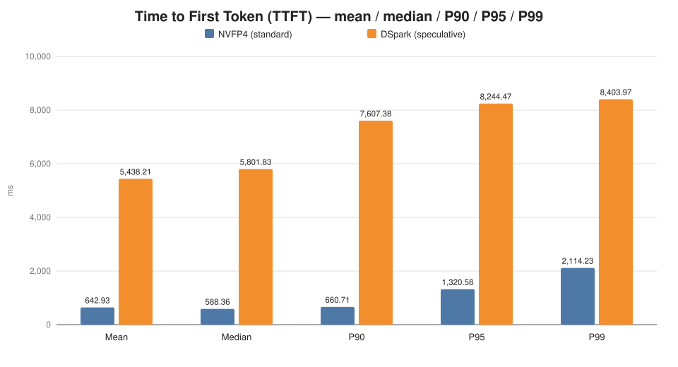
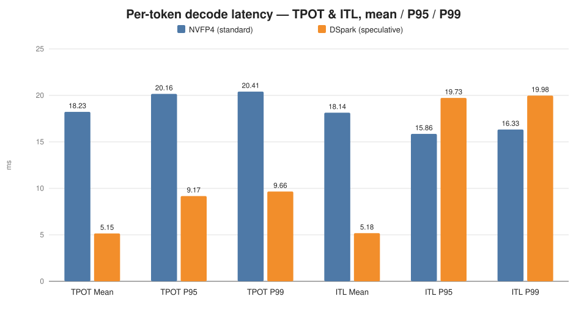
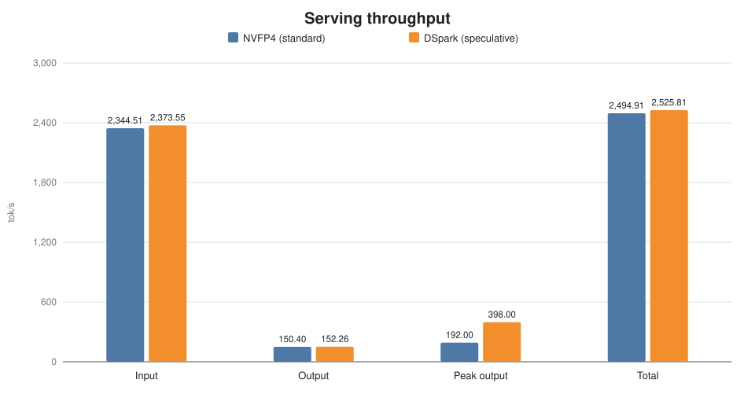

# Qwen 3.8 27B NVFP4 — SGLang on RTX 5090

Deployment and serving-benchmark scripts for running **Qwen 3.8 27B in NVFP4** on an
**NVIDIA RTX 5090** via [SGLang](https://github.com/sgl-project/sglang), packaged in Docker.

The repo contains:

- `sglang/qwen-3.8/sglang-rtx-5090-qwen-3.8-27B-NVFP4.sh` — starts the inference server in a Docker container
- `sglang/qwen-3.8/benchmark.sh` — runs SGLang's serving benchmark against that container
- `sglang/qwen-3.8/*-benchmark.txt` — recorded benchmark results
- `sglang/qwen-3.8/charts/` — benchmark graphs (SVG, generated by `charts/generate.js`)
- `sglang/qwen-3.8/sglang-rtx-5090-qwen-3.8-27B-NVFP4-dspark.sh` — experimental DS Spark speculative-decoding variant (in progress, see [below](#ds-park-speculative-decoding-in-progress))

## Benchmark results

Recorded run: `sglang-rtx-5090-qwen-3.8-27B-NVFP4-benchmark.txt`
(30/30 successful requests, concurrency 3, RTX 5090).

| Metric | Value |
|---|---:|
| Output token throughput | 150.40 tok/s (peak 192.00) |
| Input token throughput | 2,344.51 tok/s |
| Mean TTFT | 642.93 ms |
| P95 TTFT | 1,320.58 ms |
| Mean TPOT | 18.23 ms (~55 tok/s per stream) |
| Mean E2E latency | 7,784.48 ms |

### TTFT



### Decode latency (TPOT / ITL)



### Throughput



> Charts are plain SVG committed in `sglang/qwen-3.8/charts/`. To regenerate
> them after updating the benchmark text files, edit the data in
> `charts/generate.js` and run `node charts/generate.js`.

## DS Park speculative decoding (in progress)

⚠️ **Experimental — not usable for production workloads yet.**

The DS Spark variant
(`sglang-rtx-5090-qwen-3.8-27B-NVFP4-dspark.sh`) adds speculative decoding with
the `RadixArk/Qwen3.8-27B-DSpark` draft model
(`--speculative-algorithm DSPARK`). It currently caps the context window at
`--context-length 40000` (~42k tokens usable); a longer context is required
before this is usable, and that is still being worked on.

Current numbers from
`sglang-rtx-5090-qwen-3.8-27B-NVFP4-dspark-benchmark.txt` tell a mixed story:

- **Decode is dramatically faster**: mean TPOT drops from **18.23 ms → 5.15 ms**
  (~3.5×, precisely 3.54×) and mean ITL from 18.14 ms → 5.18 ms, with a
  speculative accept length of **3.85** tokens per step.
- **Prefill/TTFT is much slower**: mean TTFT jumps from 642.93 ms → 5,438.21 ms
  and P95 E2E latency rises from 9,623.30 ms → 10,908.01 ms.
- Total and per-stream throughput are roughly on par with the standard build.

The graphs above compare the two configurations. As the context window is
raised and the TTFT regression is investigated, this section will be updated.

## Prerequisites

- An NVIDIA GPU (RTX 5090) with a working NVIDIA driver
- [Docker](https://docs.docker.com/) with
  [NVIDIA Container Toolkit](https://docs.nvidia.com/datacenter/cloud-native/container-toolkit/latest/install-guide.html)
  installed (`--gpus all` must work on your host)
- A Hugging Face access token (exported as `HF_TOKEN`) so the model can be pulled
- ~32 GB of shared memory headroom — the container is started with `--shm-size 32g`

## Getting up and running

Both the server and the benchmark are run from the `sglang/qwen-3.8/` directory.
**Open two terminals** — one for the server, one for the benchmark.

### 1. Start the inference server

```bash
export HF_TOKEN=hf_xxx...   # your Hugging Face token
cd sglang/qwen-3.8
./sglang-rtx-5090-qwen-3.8-27B-NVFP4.sh
```

This launches a Docker container **named `sglang_inference`** using the
`lmsysorg/sglang:qwen38-27b` image. Notable flags:

- `--gpus all` — all visible GPUs are passed to the container
- `-p 30000:30000` — the SGLang OpenAI-compatible API is exposed on
  `http://localhost:30000`
- `-v ~/.cache/huggingface:/root/.cache/huggingface` — your host HF cache is
  mounted into the container, so the model is only downloaded once
- `--model-path RadixArk/Qwen3.8-27B-NVFP4`, `--mem-fraction-static 0.95`,
  `--attention-backend flashinfer`, and reasoning/tool-call parsers for Qwen3

The first run pulls the image and downloads the model, so give it time. The
server is ready when the logs stop streaming and you can confirm:

```bash
curl http://localhost:30000/health
```

### 2. Run the benchmark (separate terminal)

With the server running, in a **second terminal**:

```bash
cd sglang/qwen-3.8
./benchmark.sh
```

This `docker exec`s into the `sglang_inference` container and runs SGLang's
`bench_serving` against port 30000 with a random dataset: 8192-token inputs,
512-token outputs (±50% range), 30 prompts, max concurrency of 3. The result
table prints to the terminal — that's the output copied into the
`*-benchmark.txt` files in this repo.

### 3. Stop / clean up

```bash
docker rm -f sglang_inference
```

> Note: the standard and DS Spark launch scripts both use the container name
> `sglang_inference` and port 30000 — run only one at a time
> (`docker rm -f sglang_inference` between runs).

### Trying a request by hand

While the server is up:

```bash
curl http://localhost:30000/v1/chat/completions \
  -H "Content-Type: application/json" \
  -d '{"model": "RadixArk/Qwen3.8-27B-NVFP4",
       "messages": [{"role": "user", "content": "Hello!"}],
       "max_tokens": 64}'
```

## Layout

```
sglang/
└── qwen-3.8/
    ├── sglang-rtx-5090-qwen-3.8-27B-NVFP4.sh            # launch server (standard)
    ├── sglang-rtx-5090-qwen-3.8-27B-NVFP4-benchmark.txt # recorded benchmark
    ├── sglang-rtx-5090-qwen-3.8-27B-NVFP4-dspark.sh     # launch server (DS Spark, in progress)
    ├── sglang-rtx-5090-qwen-3.8-27B-NVFP4-dspark-benchmark.txt
    ├── benchmark.sh                                       # run bench_serving in the container
    └── charts/                                            # SVG graphs + generator
```
