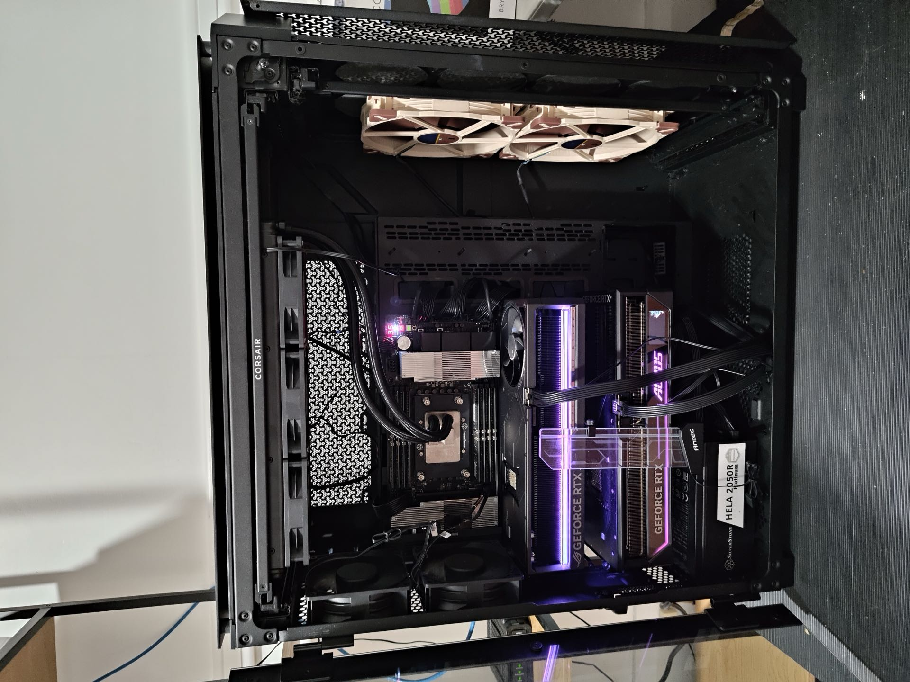

# 🖥️ The War Rig — Jayce's Home AI Lab

> **Not a product. Not a framework. Nothing here is packaged for you to deploy.**
> This is my house, my desk, my power bill, and the machine that thinks in it.
> It exists so I can point at something on my wall and say *that box runs my world*.

<p align="center">
  
</p>

<p align="center"><em>The rig. Two Blackwell cards, one desk, no cloud in sight.</em></p>

One tower. Two Blackwell GPUs. A pile of pinned containers, speculative decoding,
and quantized weights that I keep arguing with until they behave. Everything is
local, everything is mine, and no token leaves the building unless I ask it to.

---

## ⚡ The Machine

| | |
|---|---|
| **Role** | Home AI lab / inference server / "war rig" |
| **CPU** | AMD Ryzen Threadripper PRO 7965WX — 24 cores / 48 threads, Zen 4, boost to 5.36 GHz |
| **Motherboard** | ASUS Pro WS WRX90E-SAGE SE (UEFI, 07/2025 firmware) |
| **Memory** | 256 GB (currently ~160 GB resident with models warm in page cache) |
| **GPU 0** | **NVIDIA GeForce RTX 5090 Founders Edition — 32 GB** (GB202, SM120) → *the brain* |
| **GPU 1** | **NVIDIA GeForce RTX 5080 — 16 GB** (GB203, SM120) → *the staff* |
| **Driver / CUDA** | 580.159.03 / CUDA 13.0 |
| **Storage** | Samsung SSD 990 PRO with Heatsink 2 TB · btrfs · 1.82 TiB |
| **Swap** | 8 GiB zram (because swapping to NVMe is for people who give up) |
| **Network** | Intel X710 10GBASE-T + Tailscale for "from anywhere that isn't the couch" |
| **OS** | Fedora Linux 42 (Workstation), kernel 6.19.14, GNOME/Wayland, Docker + NVIDIA Container Toolkit |

**Division of labour, enforced by `device_ids` and a healthy fear of OOM:**

```
┌──────────────── RTX 5090 · 32 GB ────────────────┐   ┌──────── RTX 5080 · 16 GB ───────────┐
│  Unsloth Studio (:8888)                          │   │  asr-model      Qwen3-ASR-1.7B      │
│   └─ llama-server · Qwen3.8-27B UD-Q6_K_M        │   │  cleanup-model  Superwhisper s1-mini│
│      22 GB weights · 150K ctx · ngram+MTP spec   │   │  (2 vLLM engines, ~9.1 GiB total)   │
│                                                  │   │  Never touches the 5090. Ever.      │
└──────────────────────────────────────────────────┘   └─────────────────────────────────────┘
```

The rule: **nothing in the ASR path may reserve a byte of the 5090.**
The 5090 is for big thinking; the 5080 runs the always-on help desk.

---

## 🧠 What's Served Right Now

### Unsloth Studio — `:8888` (host-native, GPU 0)

My front door for daily driving. Studio sits on `0.0.0.0:8888`, and underneath it
llama.cpp does the actual work on a pinned build in `~/.unsloth/llama.cpp`.

| Model | Quant | Notes |
|---|---|---|
| **Qwen3.8-27B** | UD-Q6_K_M (live load; a UD-Q8_K_XL sibling sits in the same cache) | The house model. Vision via `mmproj-F16.gguf`, `--flash-attn on`, q8_0 KV cache, **speculative decoding via ngram-mod + draft-MTP**, thinking mode enabled and preserved across turns. |

The live server, verbatim from `ps`, because it's the most honest documentation in this repo:

```bash
llama-server -m .../Qwen3.8-27B-UD-Q6_K_M.gguf \
  --port 48187 --parallel 1 --flash-attn on --no-context-shift \
  -c 150144 --alias unsloth/Qwen3.8-27B-GGUF \
  --fit on --metrics --slot-save-path ~/.unsloth/studio/cache/llama-slots \
  --jinja --cache-type-k q8_0 --cache-type-v q8_0 \
  --spec-type ngram-mod,draft-mtp --spec-draft-n-max 3 \
  --spec-ngram-mod-n-match 24 --spec-ngram-mod-n-min 48 --spec-ngram-mod-n-max 64 \
  --chat-template-kwargs '{"enable_thinking": true, "preserve_thinking": true}' \
  --mmproj .../mmproj-F16.gguf --load-mode none
```

~22 GB of weights (UD-Q6_K_M), a **150,144-token context** with q8_0 KV cache, multimodal,
and it still leaves room to keep the desktop alive. A UD-Q8_K_XL sibling and Qwen3.5-27B GGUF sit in the HF cache for rotation. Yes — this README was written by the box
itself, on the model in that command line. Meta enough for a home lab.

---

## 🎙️ The 5080's Job Description

### ASR stack — dictation that beats the cloud (`services/asr/`)

Replaced Whisprflow. A MacBook menu-bar app holds one hotkey; the rig does the rest.
One upload in, one cleaned transcript out. Non-streaming, on purpose.

```
MacBook ──POST /v1/transcribe──▶ asr-api :8090 (Go)
                                   ├─▶ Qwen3-ASR-1.7B          (qwen3-asr)
                                   └─▶ Superwhisper s1-mini     (s1-mini)
```

| Piece | What it is | VRAM |
|---|---|---|
| `asr-model` | **Qwen3-ASR-1.7B** on vLLM, OpenAI `/v1/audio/transcriptions` | 6,116 MiB (util 0.42) · 12,800-tok KV |
| `cleanup-model` | **Superwhisper s1-mini** — the *smaller language model*: control-line styling register (`casual`…`formal`), punctuation, self-corrections, "um" removal, temp 0 | 3,248 MiB (util 0.2) · 13,968-tok KV |
| `asr-api` | Stdlib-only Go facade, non-root, bearer token optional, 25 MiB upload cap | — |

Measured warm: **15 s of audio → 429 ms** end to end (ASR 326 ms + cleanup 102 ms).
Cleanup dying never fails a request — you get `raw_text` back with a warning. Dictation
must survive the little model being down; only the ASR leg is load-bearing.

Two engines on one 16 GB card taught me things: they must come up **serially**
(`depends_on: service_healthy`, or vLLM's memory profiler throws
`AssertionError: Error in memory profiling`), and the stock vLLM image ships **without**
the `[audio]` extra, so every upload dies with a smug `400 Invalid or unsupported audio file`.
Hence `services/asr/model-image/Dockerfile`.

---

## 🌍 How It Powers My Home World

- **Open WebUI** `:3100` → straight at Unsloth Studio on the host gateway. The kitchen-table face of the rig. (Moved off `:3000` to make room for Langfuse.)
- **Langfuse** `:3000` — LLM observability for anything that talks to the models. The submodule's whole stack (web, worker, postgres, clickhouse, redis, minio) is included in the root compose; the playground and LLM-as-a-judge reach Unsloth Studio at `http://host.docker.internal:8888/v1` (OpenAI-compatible).
- **Unsloth Studio** `:8888` — model serving, slot save/restore, per-slot context, vision input.
- **ASR** `:8090` — voice-to-text from the laptop, LAN-wide.
- **Stealthy browser** — Camoufox (anti-detect Firefox) on a virtual display, CPU-only with Mesa
  software GL, JSON API + MCP server, noVNC for when I want to watch it work. Loopback-bound;
  agents reach it on the compose network. My agents get to browse without being fingerprinted,
  and I get to see exactly what they did. `docs/camoufox-plan.md` is the design doc.
- **Tailscale** — the rig is reachable from anywhere, and "anywhere" is still only me.

---

## 📦 Repo Map

```
ai-lab/
├── docker-compose.yml        # single stack — WebUI, Langfuse (via submodule), embedding, ASR (only unsloth + agent-browser are profile-gated)
├── Makefile                  # the only commands I remember
├── .env / .env.example       # root + ASR keys; docker compose reads .env automatically
├── workspaces/
│   └── unsloth/              # mounted into the unsloth container at /workspace/host
├── services/
│   ├── asr/                  # speech-to-text stack → RTX 5080 (always on, own net)
│   │   ├── api/              # Go facade: /v1/transcribe, /healthz + 16 test funcs
│   │   ├── model-image/      # vLLM overlay with the [audio] extra
│   │   ├── evals/            # promptfoo config for the cleanup prompt
│   │   └── prompts/          # cleanup-system.txt (mounted ro into asr-api)
│   ├── embeddings/           # ONNX embedding service (always on)
│   └── langfuse/             # submodule: LLM observability, pinned to a release tag
├── tools/
│   └── gpu-burn/             # submodule: because new rigs must be burned in
└── docs/                     # camoufox-plan.md (agent browsing design), assets/rig.jpg
```

## 🎛️ Commands

```bash
make up                       # Open WebUI + Langfuse + embedding + ASR
make down                     # stop everything (incl. profiled services)
make up-browser               # + Camoufox stealth browser
make asr-up                   # ASR stack → pinned to the 5080
make langfuse-logs            # Langfuse web + worker logs
make ps / logs / asr-logs     # staring at things

make asr-test                 # Go test suite, no GPU required
make embed-test               # embedding service health check
```

### Ports

| Port | Service | Bound to |
|---|---|---|
| `8888` | Unsloth Studio (host-native) | `0.0.0.0` |
| dynamic (now `48187`) | llama-server under Studio — Studio grabs a free loopback port per session | loopback |
| `3000` | Langfuse UI (submodule stack) | LAN |
| `3100` | Open WebUI | LAN |
| `8090` | ASR API — the only client-facing ASR surface | LAN |
| `8010 / 8011` | ASR + cleanup vLLM debug | loopback |
| `8900 / 5900` | Camoufox API / noVNC | loopback |

## 🔬 Proof, Not Vibes

`gpu-burn` exists so that when something gets weird at 3 AM, I can prove it's silicon
before I blame the quantizer — which is usually the wrong answer, but occasionally isn't.

## ⚠️ Fine Print

This is a home lab on a desk I also sleep near. Endpoints are unauthenticated by default
and expect a trusted LAN: **do not** expose Open WebUI or `asr-api` to the public
internet without a token and a TLS-terminating proxy in front. Images are pinned where it
matters and floating where I'm lazy. Model weights are pulled from Hugging Face under their
own licenses and are never redistributed here. Submodules stay attributed upstream
(Apache-2.0 throughout).

If you wandered in looking for a deployable project: thanks, but the interesting part of
this repo is that it only ever had one user, one desk, and two GPUs that refuse to share.
